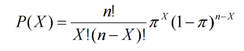
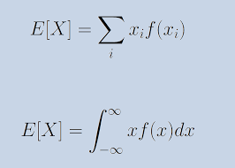

**Statistics**  
Statistics is defined as the study and practice of collecting and analyzing data or it is facts or summaries of data.

**Proxy**  
Something that is related to what we want to measure, but isn’t exactly what we want to measure.

There are two main statistics types: Descriptive and Inferential.

- 
Descriptive statistics usually include things like where the middle of the data is what statisticians call measures of central tendency and measures of how spread out the data are.While descriptive statistics can be great, they only tell us the basics. Inferential statistics allows us to make inferences.  

- 
Inferential statistics allow us to make conclusions that extend beyond the data we have in hand.  We ask inferential statistics 
  to do all sorts of much more complicated work for us. Inferential statistics let us test an idea or a hypothesis.  

If Statistics were a superhero, it’s bat call would be uncertainty, and it’s tagline would be “When you don’t know for sure,
but doing nothing isn’t an option.” Thinking mathematically isn’t just about understanding numbers better. It’s about asking important
questions about the world around us. And letting numbers illuminate those questions.  

  
**Mean**  
The mean or average takes the sum of all the numbers in a data set, and divides by the number of data points. 
The average of a set of data points tells us something about the data as a whole, but it doesn’t tell us about individual data points.

The mean is good at measuring things that are relatively “normally” distributed. “Normal” means a distribution of data that has roughly
the same amount of data on either side of the middle, and has its most common values around the middle of the data. Data that are
istributed normally will have
a symmetrical bell shape. A distribution shows us how often each value occurs in our data set, which is also known as their frequency.

**Median**  
To give unusually large or small values, also called outliers, less influence on our measure of where the center of our data is, we can use the median.
The median is the middle number if we lined up our data from smallest to largest.

**Mode**  
The word mode comes from the Latin word modus, which means “manner, fashion, or style” and gives us the French expression a la mode,
meaning fashionable.

Bimodal data is an example of “Multimodal” data which has many values that are similarly common. Usually multimodal data results
from two or more underlying groups all being measured together.When the median and mean are different, a distribution is skewed, which is a way of saying that there are some 
unusually extreme values on one side of our distribution, either large or small in our data set.  

 

Range takes the largest number in our data set and subtracts the smallest number in the set to give us the distance 
between these two extremes. The larger the distance, the more “spread out” our data is.The <b>IQR</b> looks at the spread 
of the middle50% of your data.

The sample variance would consistently be a *little* smaller than the real variance of the population.
We divide by the number of samples minus 1 in order to get the sample variance to be unbiased or a better 
guess for the population variance. The <b>Standard Deviation</b> is the square root of the variance, which gives back the units. 
You can think of the standard deviation as the average amount we expect a point to differ (or deviate) from the mean.  

There are two main types of data that we might encounter:

- Categorical
- Quantitative.

Quantitative data are quantities, numbers that have both order and consistent spacing.
Categorical data doesn’t have a meaningful order or consistent spacing.We just have to create 
categories out of our quantitative data first. We do that with a process called “binning”.
Binning takes a quantitative variable and bins it into categories that are either pre-existing
or made up.

**Histogram**  
In histograms, like bar charts, the height of the bars tells us how frequently data in a certain range occur.
The bars are squished together because the data are ‘continuous’ which means the values in one bar flow into the next bar,
there’s no separation like in our categorical bar charts.

**Stem and leaf plot**  
A stem and leaf plot is a cousin of the dotplot. It also gives us information about data
and their frequencies by stacking objects on top of each other. However, stem and leaf plots use values from
the raw data instead of dots.

**Correlation**  
Correlation measures the way two variables move together, both the direction and closeness of their movement.
You may have read articles claim that there’s a positive correlation between exercise and heart health.

When we see a non-zero slope also called a regression coefficient it’s a sign that there’s some kind of 
relationship between our two variables.The units of your variables can affect the regression coefficient, 
and can also affect the calculation of our correlation. To get around that, we use the standard deviations to scale 
our correlation so that it is always between -1 and 1. This is our correlation coefficient, r. As you get closer and 
closer to a correlation of 0, the points are more and more spread out around our regression line, and eventually
at 0, there’s no linear relationship at all, it’s just dots. 

**Squared correlation coefficient**

R^2 is always between 0 and 1, and tells us in decimal form how much of the variance in one variable is predicted by the other. 
In other words, it tells us how well we can predict one variable if we know the other. An R^2 of 1 means you can perfectly predict
one variable from the other since 100% of the variation is in one variable.

**Correlation doesn’t equal causation**  
When one thing (A) is correlated with another (B), there’s a few possible reasons

- A causes B
- B causes A
- There’s a third Variable C that causes both A and B, even though A and B aren’t related
- Or there’s no relationship at all. it’s just a coincidence. These correlations get called spurious correlations,
  and they can be hard to catch.

## Controlled Experiments

Researchers have started using simulationsto study cancer treatments.To predict the impacts of climate change.
Researchers are using VR to simulate disaster situations. And to help train people how to respond in earthquakes or floods.

Experiments try to mimic parallel universes by taking the one universe we do have, and splitting it randomly into groups.
Randomness allows us to claim that before the cappuccino makers were given out, there were no systematic differences between the
groups. Because of random allocation we can avoid <b>Allocation Bias</b>(Alocation to group by scientist) ,and <b>Selection Bias</b>(subject selecting their
own groups.  

In some situations, Researchers can also force
the number of wealthy people or vegans to be the same in each group using something called a Randomized Block Design,
but randomness usually does a pretty good job. Placebos allow us to control these effects
by “pretending” to treat everyone. Subjects in medical studies are often given sugar pills or saline drips to make it seem
like both groups are being treated. This is why we use control group, a group that get fake treatment. 

Types of study

- Blid Study - When subjects don’t know which treatment they’re receiving
  - Single Blind Study - Subjects don’t know what treatment they’re getting but the researchers do
  - Double Blind Study - Neither subjects nor researchers don't know what treatment the subjects are getting.

**Matched-Pairs Experiment**

A matched pairs design is a special case of a randomized block design. 
It can be used when the experiment has only two treatment conditions; and subjects can be grouped into pairs,
based on some blocking variable. Then, within each pair, subjects are randomly assigned to different treatments.

## Sampling Methods and Bias with Surveys

One of the most common non-experimental method is the survey. The goal of a survey is to get specific information.
Ideally, a survey should go to a random sample of the population that they’re interested in. For example, telephone surveys often use Random Digit Dialing which selects 7 random digits and dials them.

If people aren’t forced to respond to the survey, we might experience something called
Non-Response Bias in which the people who are most likely to complete a survey are systematically different from those who don’t.
This is also related to Voluntary ResponseBias in which people who choose to respond
to voluntary surveys they see on Facebook or Twitter are people who again, are different than the broad population.

Another source of bias is just plain underrepresentation. If a group of interest is a minority in the
population, random sampling paired with response biases might mean that that minority isn’t represented at all in the sample.

In a 2016 LA Times/USC political tracking poll, a 19-year-old black man was one of 3,000
panelists who was interviewed week after week about the upcoming presidential election. Because he was a member of more than one group
that was underrepresented in this poll, his response was weighted 30x more than the average respondent.

**Stratified Random Sampling**

It splits the population into groups of interestand randomly selects people from each of the
“stratas” so that each group in the overall sample is represented appropriately.

**Cluster Sampling**

Create clusters that are naturally occuring and randomly select a few clusters to survey instead of randomly selecting individuals. For this to work, clusters cannot be systematically different than the population as a whole and they should about equally represent all groups.  

**Snowball Sampling**

Issues can also arise when the population being surveyed is very small or difficult
to reach, like children with rare genetic disorders, or people addicted to certain drugs.In this case, surveyors may choose to not
use randomness at all, and instead use Snowball Sampling. That’s when current respondents are asked
to help recruit people they know from the population of interest since people tend
           to know others in their communities and can help researchers get more responses.

**Census**

A Census is a survey that samples an ENTIRE population. it minimise sampling error.
Analysis on Census data is usually more concerned with whether differences we see are large enough to make a difference in everyday life, rather than guessing IF there is a relationship.

## Science Journalism:

When reading a science story it’s important to note a couple things: who wrote it, who published it, who did the science, and who
funded the science. You should also consider who funded and completed the research the article is based on.

Only experimental studies with randomized designs and control groups have a shot at showing evidence of causation.When a study reports correlations or has mice as its main population,the results it declares May not be quite fair So be careful about generalizations.

- Henrietta Lacks - Hela cancer cells

## Probability

Statisticians talk about two types of probability: empirical, and theoretical.

- Empirical probability is something we observe nin actual data, like the ratio of girls in each individual family.It has some uncertainty, because like the samples in experiments, it’s just a small amount of the data that is available.
  -The theoretical probability on the other hand, is more of an ideal or a truth out there in the universe that we can’t directly see.

So, the empirical probability can be a good estimation of the theoretical one, even if it’s not exact.

Instead of writing out “the probability of Red” we can use the notation P(Red).
The probability of getting a red OR purple would then be written P(Red or Purple).

**Independent event**  
Two events are considered independent if the probability of one event occurring is not
changed by whether or not the second event occurred.

**Conditional Probability**  
Conditional Probability says that the probability of an event, B, given that event A has already happened, is
the probability of A and B happening together, Divided by the probability of A happening

**Bayers Theorem**  
The probability of B given A, is equal to the Probability of A given B times the Probability of B all divided by the Probability of A

Given our usage, what we want is:

**Simulations**  
Simulations take rules and create a pretend universe that follows those rules.

**Law of Large Numbers**  
In its weak form, Law of Large Numbers tellsus that as our samples of data get bigger
and bigger, our sample mean will be ‘arbitrarily’ close to the true population mean.The neat thing is that the Law of Large numbers
applies to almost any distribution as long as the distribution doesn’t have an infinite variance.

## Distributions

**Binomial**  
The binomial is a type of distribution that has two possible outcomes (the prefix “bi” means two, or twice). For example, a coin toss has only two possible outcomes: heads or tails and taking a test could have two possible outcomes: pass or fail. A Binomial Distribution shows either (S)uccess or (F)ailure.

Mean of a binomial distribution is n,the number of events we’re
looking at times p the probability of what
we’re interested in

**Bernoulli distribution**  
The Bernoulli distribution is a discrete distribution having two possible outcomes labelled by and in which ("success") occurs with probability and ("failure") occurs with probability , where . It therefore has probability density function.

**Geometric probabilities**  
Geometric probabilities tell you the probability that your first success will be on your nth try.And success here just means the event we’re interested in happens, it’s not always a good thing.
In a more general form, The Geometric Probability Formula says that the probability of the nth try being your first success, is the probability of failure to the n-1 power, times the probability
of success to the first power.

As n increases, the probability of that being
your first success gets incredibly low

Plot of Geometric Distribution

**Cumulative Geometric Distribution**  
A cumulative geometric distribution is incredibly useful because often when we ask questions
about how long we have to wait for a certain outcome, we want to consider whether it happens
before the nth trial.The smaller the probability of success is,
the more tries we’ll need on average before
we get a success.The mean and cumulative frequency of the geometric distribution can help you weigh your options.

Plot of Cumulative Geometric Distribution

**Expected value**  
The mean is a type of expectation,
it’s called the expected value of the data
because it's what we “expect” from our
data overall.

Formula for expected value for discrete and continuous variable are different

Variance is also an expectation. It tells us how spread out we expect the data to be.
The variance of the amount of money each family makes is pretty high, because people don’t
all make the same amount of money. In essence, we’re creating a new distribution (each value minus the mean squared) , and
taking the expectation of this new distribution.

Since we’re taking each value minus the
mean to the second power, we also often call
this the **second moment of the data.**

There are a lot of moments since all we do
is keep raising to higher and higher powers,
but the first four are the most useful for
our purposes

<b>Skewness is the third moment. </B>
Skewness tells us whether there are more extreme values on one side, like income or amount
won in Vegas which are both right skewed.
Skewness tells us whether there are more extreme values on one side, like income or amount
won in Vegas which are both right skewed.

Just like the variance tells us how reliable
the mean is, skewness can tell us how reliable
the variance is.
If a distribution is really skewed, then the
variance is going to be a lot higher on one side.

<b>Fourth moment - Kurtosis</b>
Kurtosis is the Expectation of the mean centered data to the fourth power.
And it’s a measure of how thick the tails
on a distribution are.

“The mean of the sum is the sum of the means”.
Similarly the variance of the sum of two independent variables is the sum of their variances.

**Z-Score**

Z-scores in general allow us to compare things
that are not on the same scale, as long as
they’re normally distributed.
In fact there’s an entire z-distribution
that allows us to calculate things like percentiles. <b>Percentiles</b> tell you what percentage of the
population has a score or value that’s lower
than yours.

Technically you can find these percentiles
for any distribution, it involves calculating
the area underneath the curve and figuring
out how much of it is below a certain value.
But that calculation can be tedious, so often
times we convert normal distributions into
standard normal--or z--distributions which
have a mean of 0 and a standard deviation of 1.

We can also think of percentiles as the probability
that a random score drawn from a z-distribution
will be lower than a given score.

**Normal Distribution**

One reason we talk so much about normal distributions
is because distributions of means are normally
distributed, even if populations aren’t. The normal distribution is symmetric, which means its mean, median and mode are all the
same value. And it’s most popular values
are in the middle, with skinny tails to either side.

In order to meaningfully compare whether two means are different, we need to know something
about their distribution: the sampling distribution of sample means. Also called the sampling
distribution for short.

**Central Limit theorem**

The Central Limit Theorem states that the distribution of sample means for
an independent, random variable, will get
closer and closer to a normal distribution
as the size of the sample gets bigger and
bigger, even if the original population distribution
isn’t normal itself. 
Their mean is always the same as the population they’re derived from. So with large samples,
the sample means will be a pretty good estimate of the true population mean. With a large sample, any distribution
with finite variance will have a distribution
of sample means that is approximately normal.

The standard deviation of a distribution of sample means is still related to the original
standard deviation. But as we saw, the bigger the sample size, the closer your sample means
are to the true population mean, so we need
to adjust the original population standard
deviation somehow to reflect this. The way we do it mathematically is to divide
by the square root of n--our sample size.

We call The standard deviation of a sampling distribution the standard error so that we
don’t get it confused with the population
standard deviation, it’s still a standard
deviation, just of a different distribution.

**Confidence Interval**

A range of values so defined that there is a specified probability that the value of a parameter lies within it.
The 95% in a 95% confidence interval tells
us that if we calculated a confidence interval
from 100 different samples, about 95 of them would contain the true population mean.
Our “confidence” is in the fact that the
procedure of calculating this confidence interval
will only exclude the population mean 5% of the time.

**T-Distribution**  
With small sample sizes, the distribution
of sample means isn’t always exactly normal,
so we often use a t-distribution instead of
a z-distribution to find out where the middle
95% of our data is.
The t-distribution, like the z-distribution,
is a continuous probability distribution that’s unimodal.
It’s a useful way to represent sampling
distributions. Generally, sample sizes that are greater than 30 are considered “large enough” because
scientists generally believe that sampling
distributions where the sample is 30+ are
close enough to normal...though 30 is an arbitrary cutoff just like 0.05.

The margin of error, just like a confidence interval, reflects the uncertainty that surrounds
sample estimates of parameters like the mean or a proportion.Confidence intervals quantify our uncertainty.
They also demonstrate the tradeoff of accuracy for precision.A 100% confidence interval will always contain the true population mean, but it’s useless.

## Making Inferences of Data

**Null Hypothesis Significance Testing (NHST)**

Null Hypothesis Significance testing is a
form of the reductio ad absurdum argument
which tries to discredit an idea by assuming
the idea is true, and then showing that if
you make that assumption, something contradictory
happens.

**p-value**  
A p-value answers the question of how “rare”
your data is by telling you the probability
of getting data that’s as extreme as the
data you observed if the null hypothesis was
true.
If your p-value was 0.10 you could say that
your sample is in the top 10% most extreme
samples we’d expect to see based on the
distribution of sample means.

A two-sided p-value is a measure
of how extreme your sample mean is, because
it tells you how often you’ll get a value
that’s as or more extreme than the one you
got.
The smaller your p-value is, the more “rare”
it would be to get your sample just by random
chance alone if the null is true.

We could set a cut of at 0.05 and say that
a p-value that is less than 0.05 is sufficient
evidence to allow us to “reject” the idea
that the null hypothesis is true.
When we can reject the null hypothesis, we
consider our result to be “statistically
significant”, which is basically a phrase
that just means “unlikely due to random
chance alone”. A cutoff of 0.05 means that we want our sample
value to be at least in the top 5% of most
extreme values in our distribution before
we consider the value evidence against that
hypothesis.
And any p-value less than the 0.05 cutoff
counts.
0.049 leads to the same conclusion as 0.0001.

“failing to reject” the null hypothesis
doesn’t mean that there isn’t an effect
or relationship, it just means we didn’t
get enough evidence to say there definitely is one.If our p-value isn’t lower than our predetermined cutoff, our alpha, we “fail to reject”
the null hypothesis. Null hypothesis testing doesn’t allow us
to “accept” or provide evidence that the
null is true, instead we’ve only failed
to provide evidence that it’s false

The null can either be true, or not true.
This means that there are four possible situations: either you correctly reject the null, mistakenly
reject the null, correctly fail to reject
the null, or mistakenly fail to reject the null.
In two of these situations we make the correct decisions, and in the other two, we’d have
made an error. The first error is called a **Type I error**,
which is rejecting the null, even if it’s true.

Since our type 1 error rate is equal to alpha,
we get to choose exactly how often we are
willing to make Type 1 errors when we choose our alpha.

type 2 error
  
Just like the rate of Type I errors is equal
to alpha, the rate of type II errors is equal to Beta.

And Type II errors are False negatives: there was an effect, we just didn’t see it.
And while both of these mean we were wrong, there’s a lot of times where we may prefer

This proportion (1-Beta) is called our statistical power. **Statistical power** tells us our chance of detecting an effect if there is one.

**Bayes’ Theorem**  
Bayes’ Theorem--or Bayes Rule--tells us
the that probability of A given B, is the
probability of B given A times the probability of A, all divided by the probability of B.This idea about updating beliefs is core to
Bayesian statistics and can be used to test hypotheses.
We start with some idea or belief about how something works.

**Bayes’ Factor**
It represents the amount of information that we’ve learned about our hypotheses from the data.

